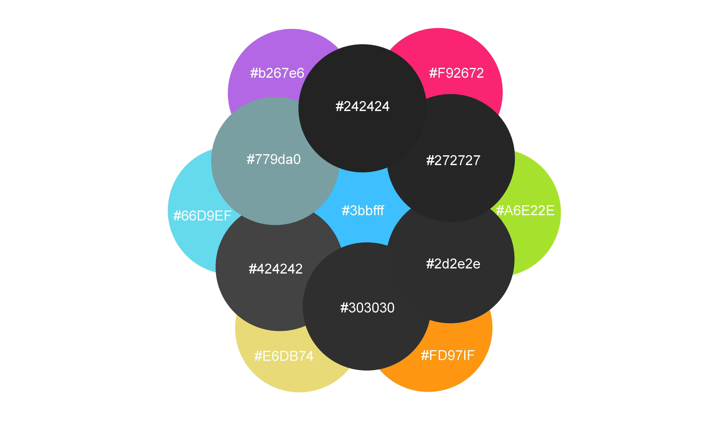

# IzyCode
IzyCode is a theme extension for *Visual Studio Code*. The theme aims to be uniform, practical and stylish. The syntax colors mimics the notorious Monokai theme wherease the editor colors are darker shades of gray with a touch of blue glow. The dark background is perfect for night sessions and colorful Monokai syntax helps concentrating on the right things.

[*Screenshot of the theme*]

## Color palette

Following colors has been used on the theme. The most outern colors are the syntax colors wherease inner colors are the editor background colors.

